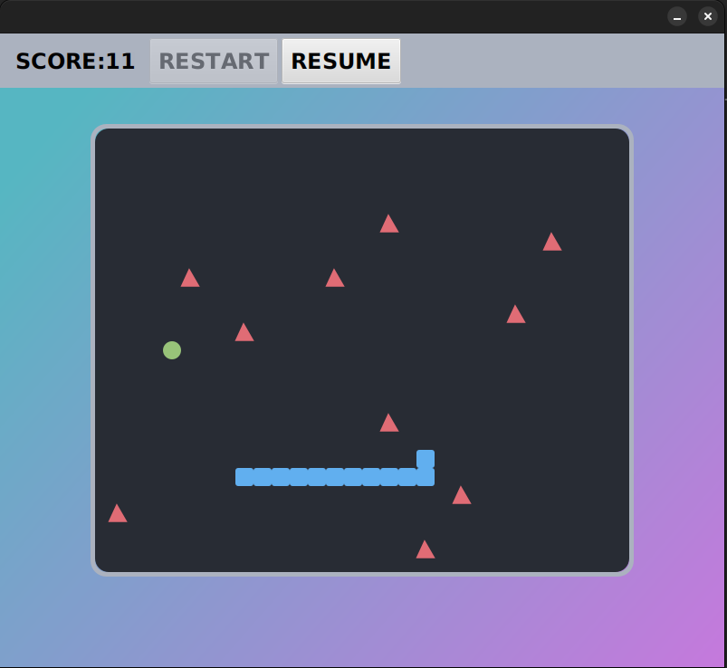

# GreedySnake in the Farm

A greedy snake game written in JavaFX.  
In the game, use UP, DOWN, LEFT, RIGHT to turn the direction of snake, once the snake eats the food, it will grow.  
But at the same time, the farm keeper will discover that the food is eaten, so he will put a trap at that place.  
To survive, snake can not collide the wall, eat itself or catch by the trap.



* How to run:
```
./mvnw clean package
./mvnw spring-boot:run
```
